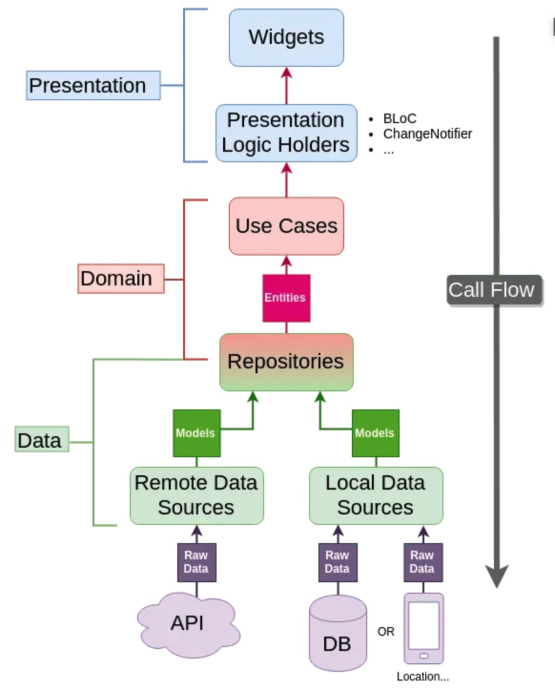

# hospitals_app

## Introducción

Este proyecto consta de una aplicación hecha en Flutter 3.10.5 y Dart 3.0.5

## Objetivo
El objetivo de la app era cumplir con los requerimientos que pedían en la prueba técnica, la cual consistía en mostrar una lista de hospitales cercanos al usuario, haciendo uso de clean architecture

## Flujo de la app

Para entender el flujo de trabajo puedes revisar esta imagen para apoyarte a entender el proyecto



## Estructura Del Proyecto

```
├─ core/                       NÚCLEO
│  ├─ colors/                  Colores usados en la app
│  ├─ errors/                  Definición de errores y excepciones
│  ├─ global/                  Definición de la API global
│  ├─ gps/                     Gestor de estado del GPS
│  ├─ map/                     Gestor de estado del mapa
│  ├─ network/                 Conexión de internet
│  ├─ routes/                  Rutas de nuestro proyecto
│  ├─ styles/                  Estilos y themes
│  └─ utils                    Navegaciones, Toast, codeState, SnackBar, Storage
│
├─ data/                       CAPA DE DATOS
│  ├─ datasources/             Origen de los datos solicitados por el repositorio
│  ├─ models/                  Modelado de datos
│  └─ repository               Implementación de los repositorios
│
├─ domain/                     CAPA DE DOMINIO
│  ├─ entities/                Entidades
│  ├─ repositories/            Definición de los repositorios
│  └─ usecases/                Implementación de los casos de uso
│
├─ presentation/               CAPA DE PRESENTACIÓN
│  ├─ business_logic/          Gestor de estados
│  ├─ views/                   Vistas
│  └─ widgets/                 Widgets personalizados utilizados en las vistas
│
├─ injection_container.dart    Inyección de dependencias
└─ main.dart

```